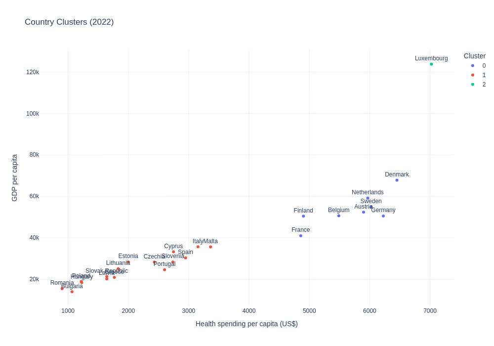
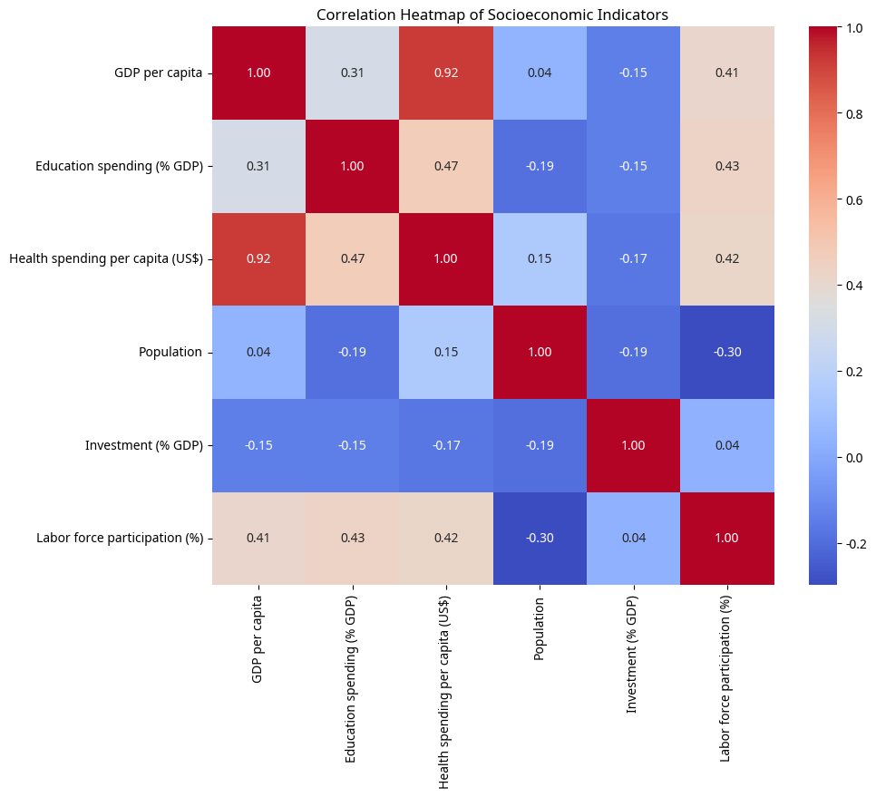

# K-Means Clustering & GDP Regression Analysis | EU Socioeconomic Policy Intelligence | Economic Research & Development Analytics

**Python · scikit-learn · Plotly · World Bank API · K-Means Clustering · Linear Regression · Decision Tree · Jupyter**

---

## The short version

Analyzed 22 years of World Bank data across all 27 EU member states to identify which policy levers - health spending, education investment, labor participation - actually move GDP. Built a K-Means clustering model that groups countries by development profile, a country-level regression model averaging R² = 0.97, and an interactive policy simulator that lets analysts test "what if" scenarios in real time. The analysis confirmed health spending as the single strongest GDP predictor (r = 0.92) and revealed a three-tier development structure across the EU that has direct implications for regional investment strategy.

---

## Business Problem

The European Union distributes hundreds of billions in structural and cohesion funds every budget cycle. The core question driving those allocations is: **which socioeconomic investments actually produce economic returns, and for which types of economies?**

A one-size-fits-all investment policy doesn't work when Luxembourg's GDP per capita is 7× Romania's. What works for a mature Western European economy doesn't necessarily translate to an emerging Eastern European one. Without data-driven country segmentation, policymakers and economic analysts risk misallocating resources — funding the wrong interventions in the wrong markets.

This project simulates the kind of analysis a policy consulting team or economic research unit would run to answer that question: segment the EU by development profile, quantify the drivers of economic output, and give stakeholders a tool to model policy impact before committing to a direction.


*K-Means clustering output: three distinct EU development tiers identified from 2022 data*

---

## Methodology

**Data Collection** - All data was pulled directly from the World Bank Open Data API using `wbdata`, covering 6 socioeconomic indicators across 27 countries from 2000 to 2022. No static dataset: the notebook fetches live at runtime, so figures stay current.

**Exploratory Data Analysis** - Started with distribution analysis (box plots by country), a Pearson correlation heatmap across all indicators, and an interactive country dashboard built with `ipywidgets` and `plotly` — letting you select any country and view all six indicators as time-series trends.

**Clustering** - Applied K-Means (k=3) on standardized 2022 data using GDP per capita, health spending, education spending, and investment rate as features. Chose K-Means because the goal was segmentation for comparison, not anomaly detection.

**Predictive Modelling** - Built separate Linear Regression models per country, using health spending, education, investment, and labor participation to predict GDP per capita. Evaluated with R² and RMSE.

**Policy Simulator** - Built a Decision Tree regressor-powered interactive tool where analysts can adjust policy sliders and get a simulated GDP outcome. Designed as a what-if exploration tool for non-technical stakeholders.

**Animated Visualization** - Built a Gapminder-style animated bubble chart showing GDP trajectories across all 27 countries from 2000 to 2020, with bubble size representing population.

---

## Skills

| Category | Tools & Techniques |
|---|---|
| Language | Python 3.11 |
| Data Manipulation | `pandas` (DataFrames, cleaning, groupby, filtering), `numpy` (array ops, normalization) |
| Visualization | `matplotlib`, `seaborn` (heatmaps, box plots), `plotly` (interactive charts, animated bubble chart) |
| Statistical Analysis | Pearson correlation, OLS regression via `statsmodels`, t-tests via `scipy` |
| Machine Learning | K-Means Clustering, Linear Regression, Decision Tree Regressor — all via `scikit-learn` |
| Model Evaluation | R², RMSE, StandardScaler for feature normalization |
| Interactive UI | `ipywidgets` (dropdown dashboard, slider-based policy simulator) |
| Data Engineering | World Bank API integration via `wbdata`, live data retrieval, missing value handling |
| Environment | Jupyter Notebook |

---

## Results & Business Recommendations


*Pearson correlation matrix — health spending per capita dominates at r = 0.92 with GDP*

**What the data showed:**

Health spending per capita is the strongest predictor of GDP across the EU (r = 0.92) — stronger than education investment, labor participation, or capital formation. This doesn't mean health spending *causes* GDP growth in a simple sense, but it's a reliable signal of where a country sits in the development hierarchy.

The K-Means model produced three clean clusters:
- **Cluster 0 - High Development:** Luxembourg, Denmark, Netherlands, Sweden, Austria, Germany, Finland, Belgium. High GDP, high health spend, stable investment rates.
- **Cluster 1 - Moderate Development:** France, Italy, Spain, Portugal, Cyprus, Malta, Slovenia, Czech Republic. Mid-range across all indicators.
- **Cluster 2 - Emerging Economies:** Romania, Bulgaria, Hungary, Poland, Slovakia, Croatia, Lithuania, Latvia, Estonia. Lower GDP base but the steepest growth trajectories over the study period.


*GDP per capita distribution — Luxembourg sits in a category of its own; Eastern European spread is tightening*

Country-level regression models hit an average R² of 0.97, meaning the five-indicator model explains nearly all GDP variance within individual countries over time.

**Recommendation:** Investment strategies targeting EU development should be cluster-specific. Emerging economy cluster countries are converging fast — the compounding returns on health and labor infrastructure investment are higher there than in already-mature markets. For Western European markets, the marginal return on additional health spend is low; the model suggests labor force participation rate as the more actionable lever.

---

## Next Steps

Given more time, three things would make this significantly more useful:

1. **Causal inference** - the regression models show correlation, not causation. Running difference-in-differences analysis around specific policy changes (e.g. post-2004 EU accession health reforms) would get closer to actual policy impact estimates.

2. **Forecasting** - extending the model with ARIMA or Prophet to project 2025–2030 GDP trajectories per cluster, which is what a consulting deliverable would actually need.

3. **Dashboard deployment** - converting the Jupyter notebook into a Streamlit or Dash web app so non-technical stakeholders can interact with the simulator without needing Python installed.

**Limitations:** The policy simulator uses a Decision Tree trained on synthetic data for demonstration - a production version would need to be retrained on historical policy change events with verified outcome data.

---

## Project Structure

```
eu-socioeconomic-clustering/
├── notebooks/
│   └── eu_socioeconomic_analysis.ipynb   # Full analysis (start here)
├── scripts/
│   └── eu_analysis_full.py               # Standalone script version
├── docs/
│   └── visualizations/
│       ├── correlation_heatmap.png
│       ├── gdp_boxplot.png
│       └── cluster_scatterplot.png
├── data/                                  # Empty — data fetched live from World Bank API
├── requirements.txt
└── README.md
```

---

## Getting Started

```bash
git clone https://github.com/severincandymellania-ux/eu-socioeconomic-clustering.git
cd eu-socioeconomic-clustering
pip install -r requirements.txt
jupyter notebook
```

Open `notebooks/eu_socioeconomic_analysis.ipynb` and run cells sequentially. Active internet connection required for World Bank API access.

---

## Author

**Candy-Mellania Severin**  
MSc Business Analytics & Data Science · UMCS, Lublin, Poland  
[LinkedIn](https://linkedin.com/in/candymellaniaseverin) · [Portfolio](https://candymellaniaportfolio.vercel.app) · [GitHub](https://github.com/severincandymellania-ux)
