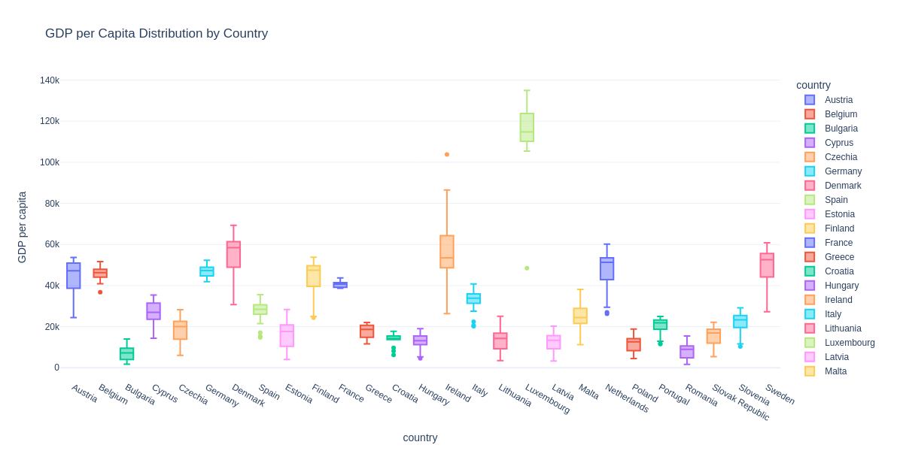

# 🇪🇺 EU Socioeconomic Clustering & Insights

**Python for Data Science — MSc Business Analytics & Data Science**  
Maria Curie-Skłodowska University (UMCS), Lublin, Poland · Semester I · January 2026  
**Author:** Candy-Mellania Severin

---

## Project Overview

This project investigates the socioeconomic landscape of all **27 European Union member states** over a 22-year period (2000–2022). Using data retrieved live from the **World Bank Open Data API**, the analysis uncovers patterns in economic output, public investment, and human development — and uses machine learning to group countries into distinct development profiles.

The project was built and explored entirely in a Jupyter Notebook environment, with an emphasis on interactive visualizations and hands-on application of data science techniques.

---

## What This Project Does

| Stage | Description |
|---|---|
| **Data Collection** | Automated retrieval of 6 socioeconomic indicators for 27 EU countries from the World Bank API (2000–2022) |
| **Exploratory Analysis** | Box plots, correlation heatmaps, and country-level trend dashboards |
| **Animated Visualization** | Gapminder-style animated bubble chart tracking GDP growth across all countries from 2000–2020 |
| **Predictive Modelling** | Country-level linear regression models predicting GDP per capita from health, education, investment, and labour indicators |
| **Clustering** | K-Means clustering to classify EU countries into three development groups |
| **Policy Simulator** | Interactive Decision Tree-powered tool allowing users to adjust policy sliders and simulate GDP outcomes |

---

## Key Findings

- **Health spending and GDP are strongly correlated** (r = 0.92) — the single strongest predictor of economic output across EU countries
- **Three distinct development clusters** emerged from K-Means analysis:
  - *High Development* — Northern & Western Europe (Luxembourg, Denmark, Ireland)
  - *Moderate Development* — Continental & Southern Europe (France, Italy, Spain)
  - *Emerging Economies* — Eastern Europe (Bulgaria, Romania, Poland)
- **Eastern European countries show the steepest growth trajectories**, converging toward Western European levels over the study period
- Country-level regression models achieved an **average R² of 0.97**, indicating strong predictive fit

---

## Visualizations

### Correlation Heatmap
Pairwise Pearson correlations between all six socioeconomic indicators — highlights the dominant role of health spending.


### GDP per Capita Distribution
Box plot showing the spread and outliers in GDP per capita across all 27 member states, illustrating significant economic disparity within the EU.



### Country Development Clusters
K-Means scatter plot grouping EU countries by GDP and health spending in 2022, revealing the three-tier development structure.


---

## Project Structure

```
eu-socioeconomic-clustering/
├── notebooks/
│   └── eu_socioeconomic_analysis.ipynb   # Full analysis notebook (recommended entry point)
├── scripts/
│   └── eu_analysis_full.py               # Standalone Python script version
├── docs/
│   └── visualizations/
│       ├── correlation_heatmap.png
│       ├── gdp_boxplot.png
│       └── cluster_scatterplot.png
├── data/                                  # Empty — data is fetched live from World Bank API
├── requirements.txt
└── README.md
```

> **Note on the `data/` folder:** No static dataset is included. The notebook fetches all data dynamically from the World Bank API at runtime, ensuring the analysis always uses the most current available figures.

---

## Getting Started

### Prerequisites
- Python 3.8 or higher
- pip
- Active internet connection (for World Bank API access)

### Installation

```bash
# 1. Clone the repository
git clone https://github.com/severincandymellania-ux/eu-socioeconomic-clustering.git
cd eu-socioeconomic-clustering

# 2. Install dependencies
pip install -r requirements.txt
```

### Running the Notebook (Recommended)

```bash
pip install jupyter
jupyter notebook
```

Open `notebooks/eu_socioeconomic_analysis.ipynb` and run cells sequentially. The interactive dashboard, animated chart, and policy simulator all require a Jupyter environment to function.

### Running as a Script

```bash
python scripts/eu_analysis_full.py
```

> Note: Running as a script will execute the analysis pipeline but will not display interactive `ipywidgets` elements (dropdown dashboard, policy simulator). Use Jupyter for the full experience.

---

## Technologies & Libraries

| Category | Libraries |
|---|---|
| Data Manipulation | `pandas`, `numpy` |
| Visualisation | `matplotlib`, `seaborn`, `plotly` |
| Statistical Analysis | `scipy`, `statsmodels` |
| Machine Learning | `scikit-learn` (Linear Regression, K-Means, Decision Tree) |
| Interactive UI | `ipywidgets` |
| Data Source | `wbdata` (World Bank API client) |

---

## Data Source

All data is sourced from the **[World Bank Open Data API](https://data.worldbank.org/)**, licensed under [Creative Commons Attribution 4.0 (CC BY 4.0)](https://creativecommons.org/licenses/by/4.0/).

| Indicator Code | Description |
|---|---|
| `NY.GDP.PCAP.CD` | GDP per capita (current US$) |
| `SE.XPD.TOTL.GD.ZS` | Education spending (% of GDP) |
| `SH.XPD.CHEX.PC.CD` | Health spending per capita (US$) |
| `SP.POP.TOTL` | Total population |
| `NE.GDI.TOTL.ZS` | Gross capital formation / Investment (% of GDP) |
| `SL.TLF.CACT.ZS` | Labour force participation rate (%) |

---

## Author

**Candy-Mellania Severin**  
MSc Business Analytics & Data Science · UMCS, Lublin, Poland  
[LinkedIn](https://linkedin.com/in/candymellaniaseverin) · [Portfolio](https://candymellaniaportfolio.vercel.app) · [GitHub](https://github.com/severincandymellania-ux)
